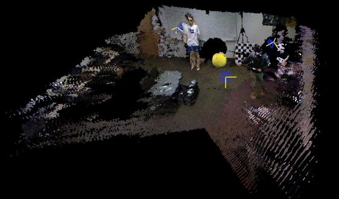
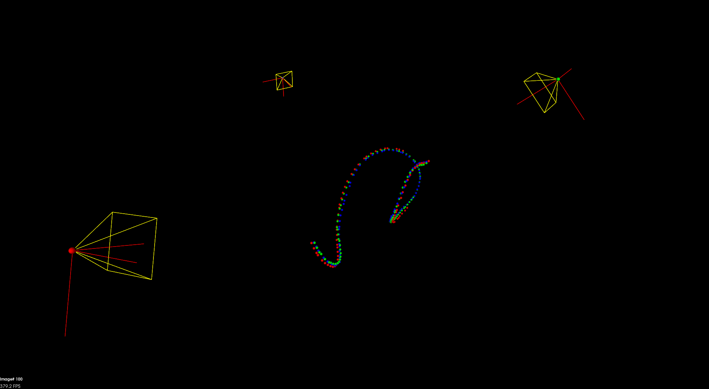
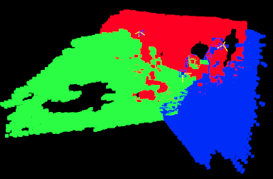
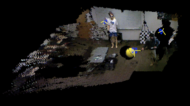

# Camera Network Calibration for 3D Scene Rendering

This demo shows how to calibrate a wide-baseline camera network for 3D scene rendering.  
By using a sphere ball with RGB-D data captured by each camera, the sphere center in each frame can be estimated.  
Then, the sphere center points from each camera are registered to the world coordinate based on the estimated camera view transformation.  
The calibrated camera network can combine the field of view from each camera to reconstruct a medium-size indoor environment.

| 3D indoor scene rendering                             | Estimations of camera pose and sphere location                     |
|:-----------------------------------------------------:|:------------------------------------------------------------------:|
| | |

## Dependencies for Running Locally (Linux)
* cmake >= 2.8
  * [click here for installation instructions](https://cmake.org/install/)
* make >= 4.1
  * Linux: make is installed by default on most Linux distros
* OpenCV >= 4.1
  * The OpenCV 4.1.0 source code can be found [here](https://github.com/opencv/opencv/tree/4.1.0)
* gcc/g++ >= 5.4
  * Linux: gcc / g++ is installed by default on most Linux distros
* PCL 1.2
  * Download PCL [here](https://pointclouds.org/downloads/)

## Basic Build Instructions

1. Clone this repo: `https://github.com/PoChang007/RGBD_CameraNetwork_Calibration.git`
2. `cd RGBD_CameraNetwork_Calibration/extrinsic_calibration_demo`
3. `mkdir build && cd build`
4. Compile: `cmake .. && make -j4`
5. Run it: `./camera_calibration`

## Basic Workflow

Given RGB-D images from each camera (three cameras here), the program will first load RGB-D images and detect the sphere center in 3D from each frame. This part is done in parallel. Each camera will have its own `sphere center path` (e.g. 100 frames will have 100 sphere center locations). Then, we align these `sphere center path` to the world coordinate (i.e. the first camera's coordinate) and get the estimated transformation matrices. We apply these transformation matrices to transform 3D data from each camera to the world coordinate and render the results by using PCL visualizer. The estimated sphere center is drawn in blue color in OpenCV window.

## File Structure

* `src/` contains `rgbdCameraNetwork.cpp`, `calibrationHandler.cpp`, `threeDViewer.cpp` and `sphereTracking.cpp`
* RGB-D sensor data is stored in `src/sensors`
* In each frame, the location of the estimated sphere is stored in `src/tracking/path_0X.txt` and its corresponding estimated sphere radius is stored in `radius_0X.txt`, respectively
* The transformation matrices (`rotation_x_1.txt` and `translation_x_1.txt`) to the reference coordinate are stored in `src/`

| Class Name         | Description                               |
|--------------------|-------------------------------------------|
| CalibrationHandler | This class is used to initialize multi-threaded processing for sphere center detection from each camera and calculate extrinsics between cameras |
| SphereTracking     | This class is used to detect the sphere center based on RGB-D images |
| ThreeDViewer       | This class is for visualization, including 3D point cloud rendering and 2D/3D sphere center visualization |

The program's interface, `rgbdCameraNetwork.cpp`, is used to start the process of camera network calibration. The calibration results are rendered in the 3D viewer. The controllable functions are described below:  

## Usage

After the camera network calibration processing is done, in 3D viewer,

* Press `z` to switch on/off a single color rendering for each camera (point cloud rendering mode).
* Press `1`, `2`, or `3` to switch on/off each camera view (point cloud rendering mode)
* Press `a` to switch on/off the mode that renders the locations of estimated sphere center 
* Press `r` to change point cloud viewer to a top-down view

Each camera pose is rendered by `DrawCameraFrustum`.  
Each sphere center in 3D is rendered by `DrawSphereIn3DSpace`, in 2D is `DrawSphereCenterIn2DImage`.  

|Field of view rendered by different color for each camera| Switch off the 3rd camera |
|:-------------------------------------------------------:|:-------------------------:|
| |  | 

## Programming Details

### Loops, Functions, I/O

* The `SphereTracking` class consists of several functions for sphere center detection: `LoadImage`, `Compute3Dpoints`, `ComputeSpehereCenter`, `SphereFitting`, etc. In `ThreeDViewerClass`, `if else` is used in `DrawSphereIn3DSpace` function to draw the sphere center in different color from different color based on the given index 
* Color and depth images are read for sphere center detection and 3D point cloud rendering. The estimated sphere center locations and transformation matrices are written into .txt. files. See [File Structure section](#File-Structure)

### Object Oriented Programming

* All class data members are explicitly specified as public or private. Some private data can be obtained by using public getter function
* `SphereTracking` class constructor utilizes member initialization lists
* Functions and data related to sphere tracking are grouped into `SphereTracking` class. Invariant data `_estimated_radius` is hidden from the user `CalibrationHandler`

### Memory Management

* In `ThreeDViewer` class, functions `DrawSphereCenterIn2DImage` and `DrawSphereIn3DSpace` use pass-by-reference for arguments `cam_index` and `frameCounter`
* All of the classes in the project use destructors to deallocate OpenCV matrix
* In CalibrationHandler.cpp, the function `StartProcessing` uses std::move to move the smart pointer (to `SphereTracking`) to the thread
* The smart pointers are used in `rgbdCameraNetwork.cpp` and `CalibrationHandler.cpp` for 3D scene rendering handler and camera calibration handler

### Concurrency

* `std::async` is used in `CalibrationHandler::StartProcessing()` to detect sphere center based on RGB-D images captured from each camera. The images in each camera will be processed in different thread 
* When a thread finishes the task of sphere center detection, the function `CalibrationHandler::StoreClientInfo` is called and will store the necessary data in `CalibrationHandler::cameras` for the use of extrinsic estimation, and then print the detection complete message. A lock guard is used to prevent data race between threads if they try to save the data into `CalibrationHandler::cameras` at the same time